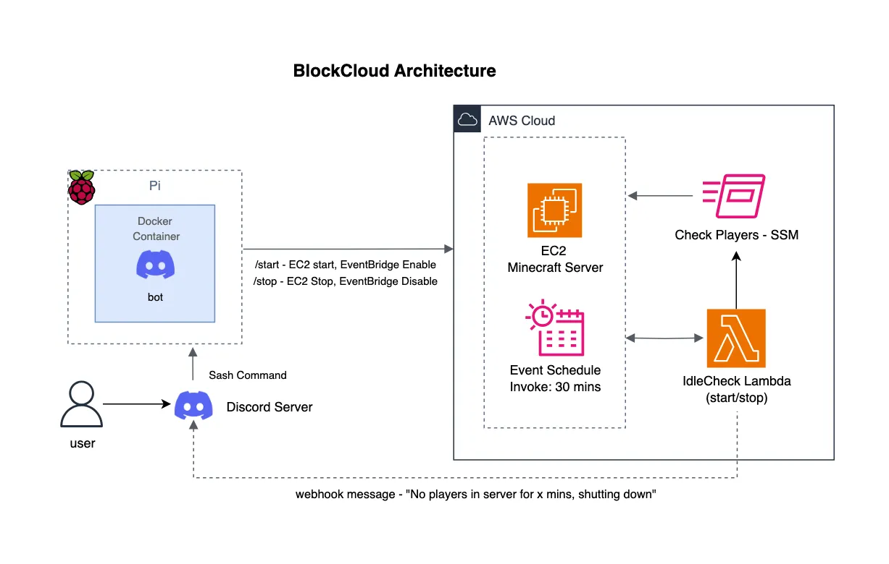

## BlockCloud

**BlockCould** is a project that integrates a Discord Bot and an AWS Serverless function to showcase my full-stack + cloud engineering skills. 

My goal was to use a Discord bot to start our Minecraft Server that will be on a EC2 instance on behalf instead of waitng for the friend that had the server on their computer and port forwarding their modem. 

I wanted to also strengthen my understanding of AWS cloud services while also considering the cost optimization strategies (because we are broke...).

### Project Overview

- **Discord Bot** - Automates AWS tasks (start/stop EC2 instance, checks the status)
  - **Docker + Raspberry Pi** - The Discord Bot containerzied with Docker and is deployed on a Raspberry Pi for lightweight, always-on hosting. 

- **Idle Check** - A scheduled service using AWS Lambda + EventBridge 

## Architecture Diagram

## Challenges & Learnings

1. **Docker on Raspberry Pi** 

   Running the bot container on an ARM-based device caused compatibility issues. Although the container stayed active, slash command requests didn’t go through at first. After debugging, I realized the Raspberry Pi needed its own AWS credentials. I created a dedicated IAM user, stored credentials securely in an .env file, and got the bot working end-to-end. 

2. **EventBridge**

    This was my first time using EventBridge to connect a Discord bot with a Lambda function. While I was able to create a rule that stopped idle servers after a set time, integrating it with the bot caused issues: the rule sometimes triggered incorrectly or fired before the EC2 instance had fully started. I solved this by refining the event logic and adding proper ordering between start/stop workflows.

3. **AWS SDK & Debugging**

    - Learning the AWS SDKs for both Node.js and Python required digging into the official docs to understand their structure.

    - Debugging Lambda meant relying on CloudWatch logs to fine-tune event patterns and limits. 

    - Minecraft status library required a fixed IP, but since I avoided attaching an Elastic IP to save costs, I used AWS SSM to dynamically fetch the instance’s publie IP address. 

## Tech Stack
 - Applicaion: Node.js, Python
 - Infra: AWS Lambda, EC2, EventBridge, IAM, SSM
 - Deployment: Docker, Raspberry Pi 4 