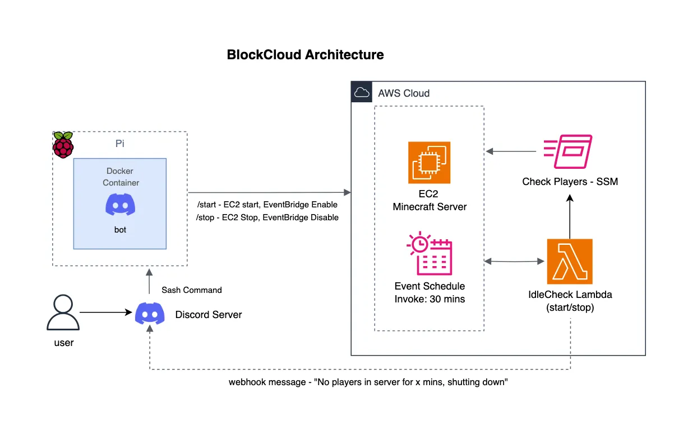

## BlockCloud

**BlockCloud** is a project that integrates a Discord Bot and an AWS Serverless function to showcase my full-stack + cloud engineering skills.

My goal was to use a Discord bot to start a Minecraft Server hosted on an EC2 instance — instead of relying on a friend to host locally and port-forward their modem.

I also wanted to strengthen my understanding of AWS cloud services while applying cost optimization strategies (because we are broke...).

### Project Overview

- **Discord Bot** — Automates AWS tasks (start/stop EC2 instance, checks the status)
  - **Docker + Raspberry Pi** — The Discord Bot is containerized with Docker and deployed on a Raspberry Pi for lightweight, always-on hosting.

- **Idle Check** — A scheduled service using AWS Lambda + EventBridge Scheduler that automatically stops the server after 30 minutes of inactivity.

- **IaC** — All AWS infrastructure is provisioned with Terraform.

## Architecture Diagram



---

## Components

### `discord_bot/`

Node.js + TypeScript Discord bot that exposes slash commands to control the Minecraft server.

| Command | Description |
|---------|-------------|
| `/start` | Starts the EC2 instance, waits for running state, returns public IP, enables idle check rule |
| `/stop` | Disables idle check rule, stops EC2 instance |
| `/status` | Returns the current EC2 instance state |
| `/help` | Lists available commands |

**Stack:** discord.js v14, AWS SDK v3 (EC2 + EventBridge Scheduler), TypeScript, Docker

**Deployment:** Docker container on a Raspberry Pi 4 (ARM-compatible image)

#### Required Environment Variables

```env
DISCORD_TOKEN=your-discord-bot-token
CLIENT_ID=your-discord-application-id
EC2_INSTANCE_ID=i-xxxxxxxxxxxxxxxxx
EVENTBRIDGE_RULE_NAME=mc-idle-check
AWS_REGION=us-east-1
```

See [discord_bot/.env.example](discord_bot/.env.example).

---

### `idle_check/`

Python AWS Lambda function that runs on a schedule (via EventBridge Scheduler) to monitor player activity and auto-stop the server when idle.

**Logic:**
- Queries player count from the Minecraft server using `mcstatus`
- If 0 players are online: sends `save-all` + `stop` via SSM, disables the EventBridge rule, stops the EC2 instance, and notifies Discord via webhook
- Runs every 2 minutes while the server is active

**Stack:** Python 3.13, boto3, mcstatus, requests

#### Required Environment Variables (Lambda)

```
INSTANCE_ID=i-xxxxxxxxxxxxxxxxx
EVENTBRIDGE_RULE_NAME=mc-idle-check
DISCORD_WEBHOOK_URL=https://discord.com/api/webhooks/...
AWS_REGION=us-east-1
```

---

### `terraform/`

Terraform IaC that provisions all AWS resources:

- **Lambda function** (`minecraftLambda`) — Python 3.13, auto-zips with dependencies
- **EC2 instance** — t4g.large, Amazon Linux 2023 ARM64, latest AMI fetched dynamically
- **Security Group** — ports 25565 (Minecraft) and 22 (SSH)
- **EventBridge Scheduler** — `rate(2 minutes)`, targets Lambda
- **Lambda permission** — allows EventBridge Scheduler to invoke Lambda
- Fetches pre-existing IAM roles and SSM instance profile via `data` sources

See [docs/terraform-iac-reference.md](docs/terraform-iac-reference.md) for a full walkthrough.

**Setup:**

```bash
cd terraform/
cp terraform.tfvars.example terraform.tfvars
# fill in terraform.tfvars with your Discord webhook URL
terraform init
terraform plan
terraform apply
```

---

### `scripts/setup.sh`

EC2 user data script that runs on first boot:

- Installs Java 21 (Amazon Corretto)
- Downloads and installs Minecraft Forge
- Creates a `minecraft` user and server directory at `/opt/minecraft/server`
- Generates `start` / `stop` scripts
- Registers a `minecraft.service` systemd unit for auto-restart on reboot

---

## Challenges & Learnings

1. **Docker on Raspberry Pi** — Running the bot on an ARM device caused AWS credential issues. I created a dedicated IAM user with least-privilege permissions, stored credentials in `.env`, and got the bot working end-to-end.

2. **EventBridge Scheduler** — First time using the new Scheduler API (not legacy CloudWatch Events). Race conditions between EC2 starting and the rule enabling required careful ordering of start/stop workflows. IAM trust policy `Condition` blocks also silently blocked invocations until I understood the issue.

3. **AWS SDK & Debugging** — Learning both the Node.js and Python AWS SDKs from scratch. CloudWatch logs were essential for tuning Lambda behavior. Used SSM to dynamically fetch the instance's public IP since I skipped Elastic IP to save costs.

## Tech Stack

| Layer | Technology |
|-------|-----------|
| Bot | Node.js, TypeScript, discord.js v14 |
| Serverless | Python 3.13, AWS Lambda, EventBridge Scheduler |
| Infrastructure | AWS EC2 (t4g.large), SSM, IAM, Security Groups |
| IaC | Terraform |
| Deployment | Docker, Raspberry Pi 4 |

## Future Goals

- Add Elastic IP for a permanent server address
- More slash commands using SSM (save, reset, debug MC server)
- Role-based Discord permissions so only certain members can control the server

## License

This project is licensed under the [Apache License 2.0](https://www.apache.org/licenses/LICENSE-2.0).
